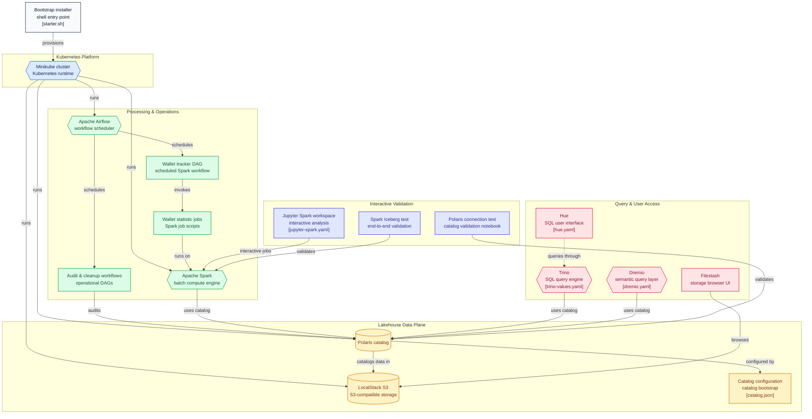

# Minikube Lakehouse Projesi

Bu proje, Minikube üzerinde çalışan, Apache Iceberg tablo formatını kullanan lokal bir Lakehouse mimarisidir. 

## Kullanılan Araçlar
- **Minikube & Helm:** Kubernetes altyapısı ve paket yönetimi.
- **Localstack:** S3 uyumlu Object Storage (Veri gölü).
- **Apache Spark:** Veri işleme motoru.
- **Apache Iceberg:** Lakehouse (ACID) tablo formatı.
- **Apache Airflow:** Zamanlanmış görevler.
- **Jupyter Notebook:** Analitik görevler.


## Kurulum Adımları

1. **Starter.sh Çalıştırın:**
   ```bash
   bash starter.sh
   ```
   Bu sizin için gerekli tüm hazırlıkları yapacaktır.


